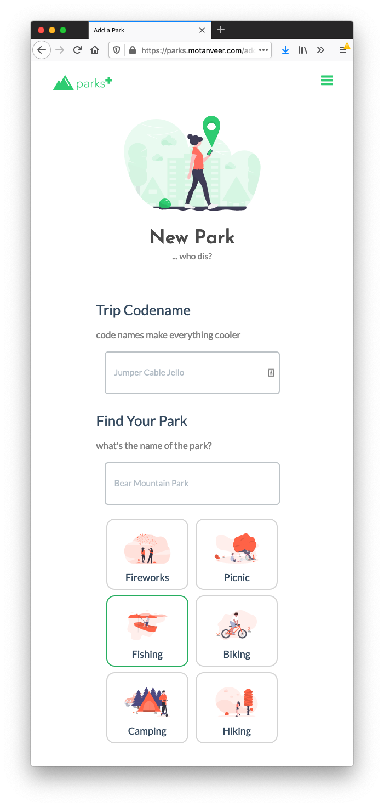

# **ParksPlus**

🌟 Simple front-end webapp built w/ Bootstrap and plain ol' Vanilla Javascript.

👨🏾‍💻 
I built ParksPlus as partially as a design excersize, and also, to see what I could accomplish without the use of any Javascript based frameworks.

**Check out the demo** 👉 **[here](https://parks.motanveer.com)**

This project uses the following resources and technologies:

- Vanilla JS + some minimal jQuery
- Bootstrap 4
- Flat UI Bootstrap Theme (Free Version)
- Animate.CSS
- Font Awesome (Free Version)

